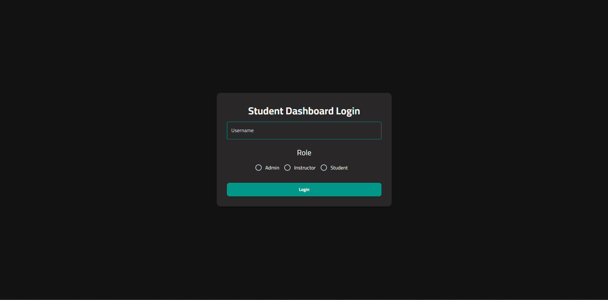
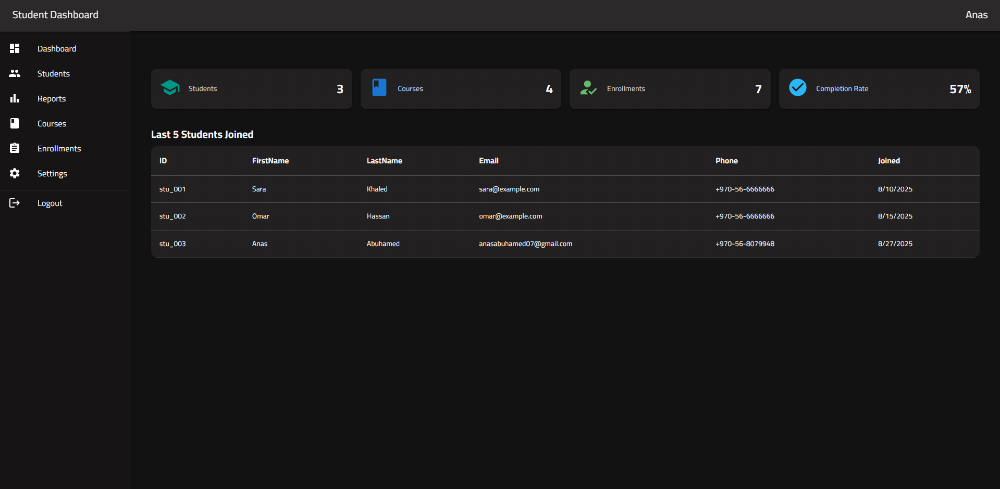
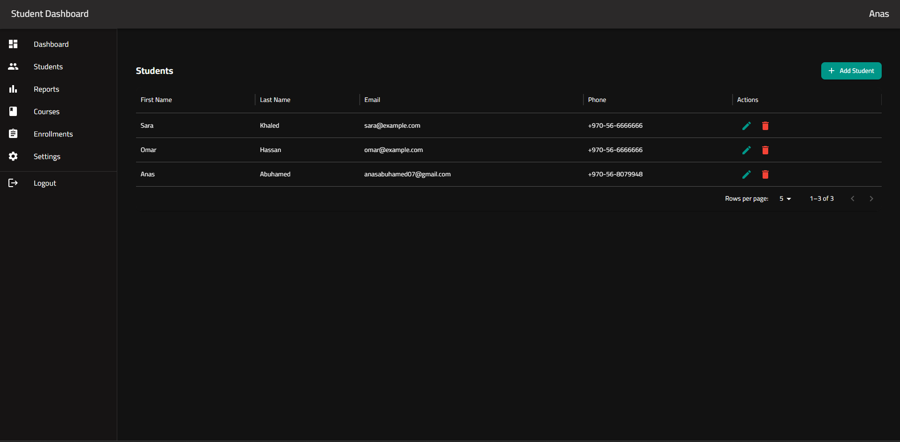
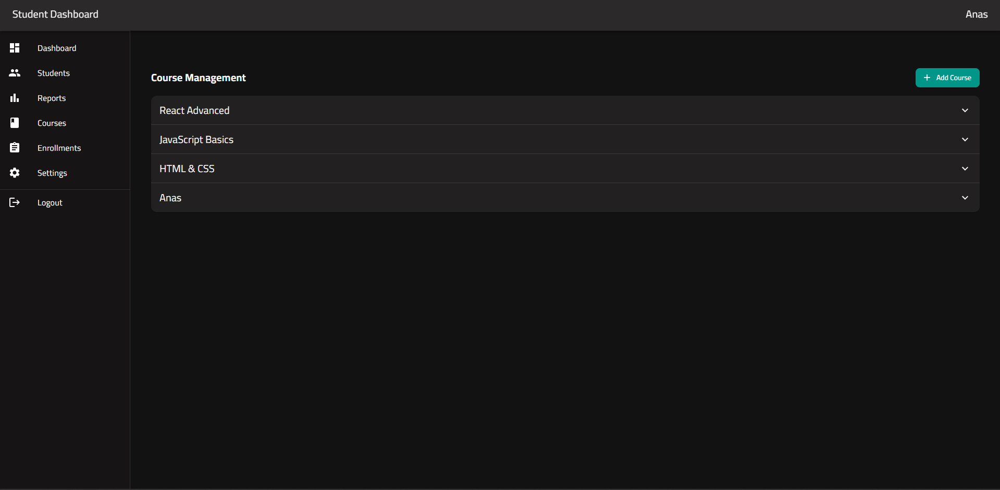
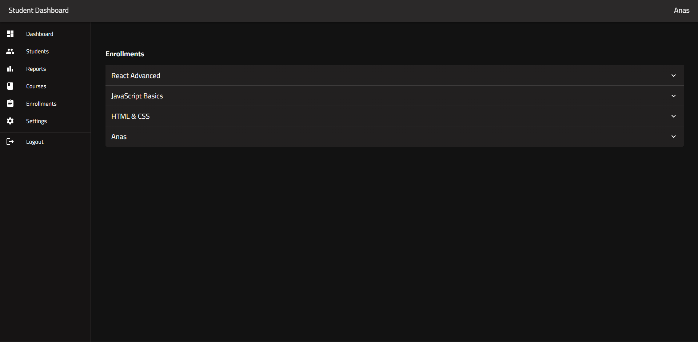
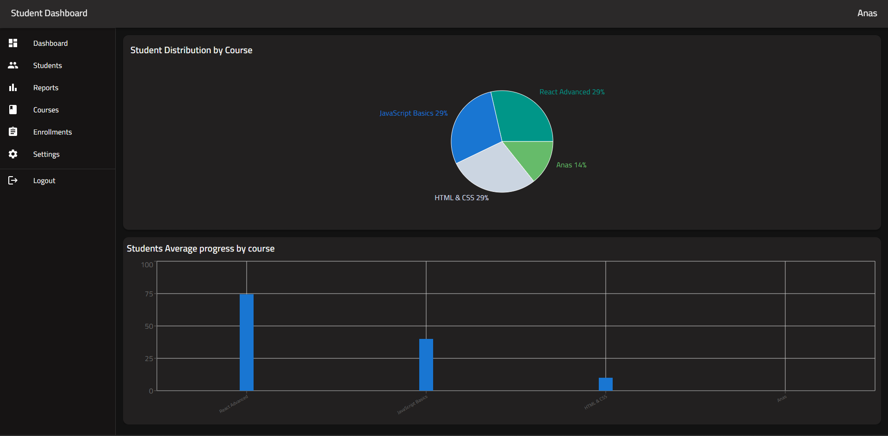
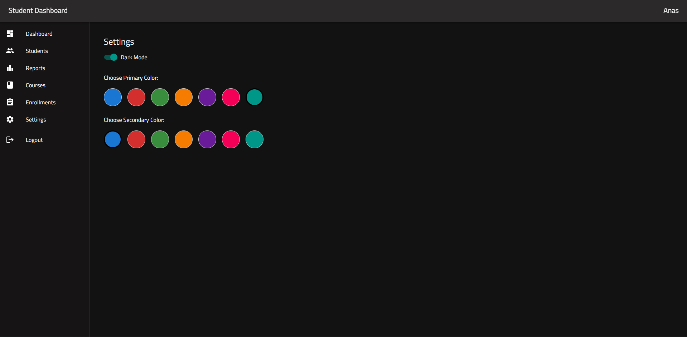

# 📘 Student Management Dashboard (React + MUI)

A **frontend-only Student Management Dashboard** built with **React 18** and **Material-UI v6 (MUI)**.  
Manage students, courses, and enrollments locally using **LocalStorage**.

---

## 🖥 Screenshots

### Login Page



### Dashboard Page



### Students Page



### Courses Page



### Enrollments Page



### Reports Page



### Settings Page

## 

## 📖 Overview

This project simulates a student management system with an advanced UI, allowing:

- **CRUD** operations for Students, Courses, and Enrollments.
- Interactive **charts** for analytics.
- Responsive design using **MUI Grid & Box**.
- Theme toggle (Light/Dark) with saved preference.

---

## 📂 Features

- **Authentication:** Simple login with role (`Admin` / `Instructor` / `Student`) stored in LocalStorage.
- **Dashboard:** Cards showing totals and latest 5 students.
- **Students Management:** DataGrid with search, filter, sort, pagination. Add/Edit/Delete via Dialog + Form.
- **Courses Management:** Accordion/List with details and CRUD operations.
- **Enrollments:** Enroll/Unenroll students, set progress per course.
- **Reports:** Charts showing student distribution and course completion.
- **Settings:** Theme switch and color picker.

---

## ⚡ Tech Stack

- **Frontend:** React 18, Material-UI v6 (MUI)
- **Routing:** React Router v6
- **Forms & Validation:** Formik + Yup
- **Charts:** Recharts
- **State Management:** React Context API
- **Storage:** LocalStorage

---

## 📁 Project Structure

src

- components
  - common
    - ConfirmDialog.jsx
    - ContainerBox.jsx
    - LoadingSpinner.jsx
    - MUICard.jsx
    - MUIDataGrid.jsx
    - MUIDialog.jsx
    - MUISnackbar.jsx
    - MUIStandardTable.jsx
    - MUITextField.jsx
    - PageHeader.jsx
    - StatCard.jsx
  - courses
    - CourseAccordion.jsx
    - CoursesForm.jsx
  - enrollments
    - CourseAccordion.jsx
    - EnrollmentForm.jsx
    - EnrollmentList.jsx
  - ProtectedRoutes
    - AdminRoute.jsx
    - ProtectedRoute.jsx
  - reports
    - ReportsBarChart.jsx
    - ReportsPieChart.jsx
  - settings
    - ColorPicker.jsx
    - ThemeToggle.jsx
  - student
    - EnrollmentItem.jsx
    - EnrollmentList.jsx
    - StudentProfileCard.jsx
  - students
    - StudentActions.jsx
    - StudentFormDialog.jsx
    - StudentsTable.jsx
- lib
  - seed.js
  - storage.js
  - validators.js
- pages
  - Courses.jsx
  - Dashboard.jsx
  - Enrollments.jsx
  - Login.jsx
  - Reports.jsx
  - Settings.jsx
  - Student.jsx
  - Students.jsx
- App.css
- App.jsx
- main.jsx
- theme.js

## 🚀 Getting Started

### 1️⃣ Clone the repository

```bash
git clone https://github.com/Anas-Abuhamed/Students-Dashboard-Management-With-React-MUI.git
cd student-management-dashboard
```

### 2️⃣ Install dependencies

```
npm install
```

### 3️⃣ Run the development server

```
npm run dev
```
